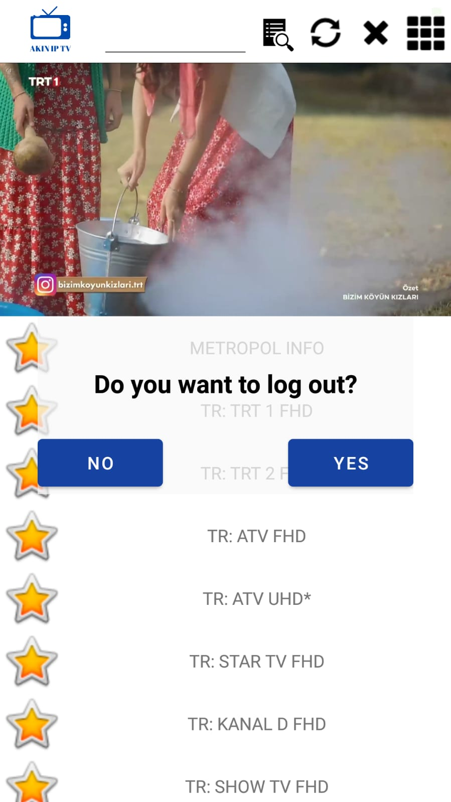

# ***   AKIN IP TV    ***
## Images

## HOW TO USE
 You have must ip tv link. install akiniptv.apk and run. Write ip tv link and touch Watch button. Wait 30 secound than open your channels
## APK File
Apk file is in apk diroctory
 ## Backend Link
 > https://github.com/brkn45/iptvApi
